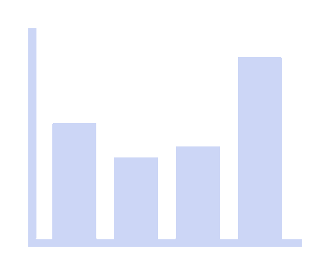

## <picture>  </picture> **About me**

<picture>
  <source media="(max-width: 768px)" srcset="">
  
</picture>

 

Hello, and welcome to my GitHub profile! My name is Álvaro Seral, and I am a Computer Engineering student with a determination to learn and grow as persistent as a machine learning algorithm, constantly iterating to improve my skills and knowledge. I am excited to explore new frontiers, face challenges and make my mark in the digital world.

  

<!--    -->

## <picture>  </picture> **Skills**

### **• Programming Languages**

   
   
   
   
   
   
  
### **• Frameworks**
  
   
  
### **• Database Management Systems**  

   
   
   
  
### **• Tools**  

    
  
   
     

 

<!--    -->

## <picture>  </picture> **Stats**

 

  
  

 
